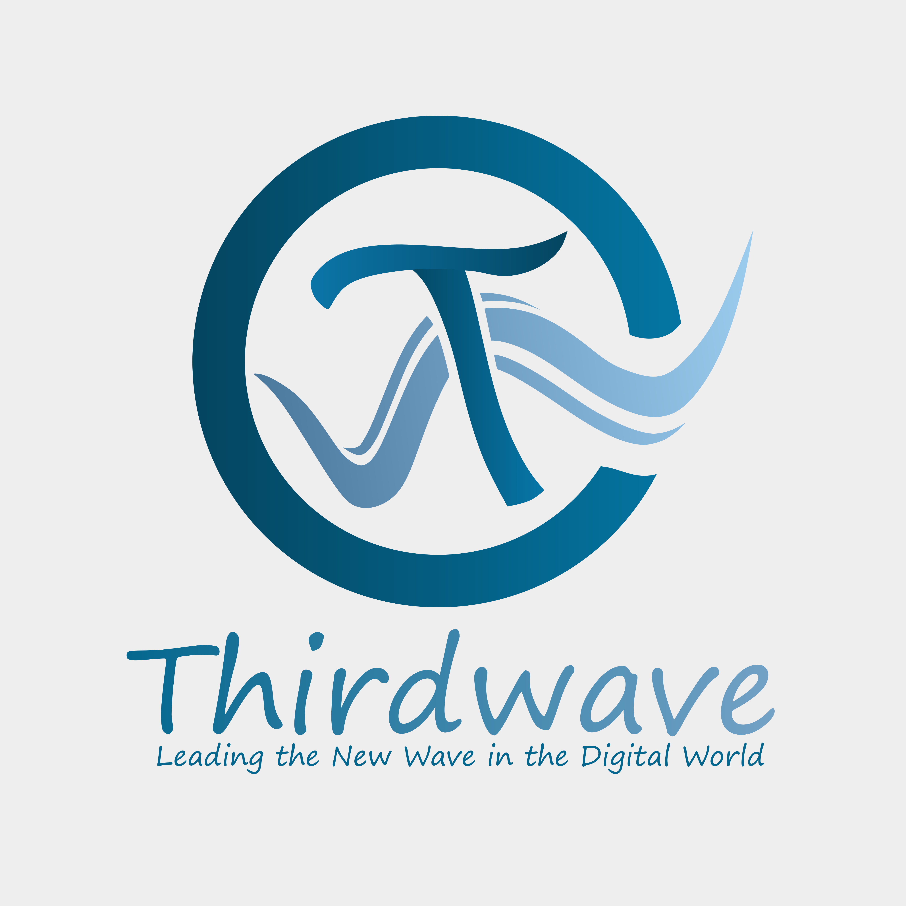

# 🚀 Project Website DP3AP2KB Provinsi Sumatera Barat

<p align="center">
  
</p>

<p align="center">
  Sebuah platform digital untuk manajemen dan pengelolaan data internal kedinasan pada Dinas Pemberdayaan Perempuan & Perlindungan Anak Provinsi Sumatera Barat.
</p>

<p align="center">
  
  
  
  
  
</p>

---

## 📂 Struktur Proyek

Proyek ini memiliki arsitektur yang terpisah antara backend dan frontend, yang berada dalam direktori `src`:

-   `src/Backend`: Direktori untuk seluruh kode sumber sisi server (API) yang dibangun dengan **Laravel**.
-   `src/Frontend`: Direktori untuk seluruh kode sumber sisi klien yang dibangun dengan **Vue 3 + Vite**.

---

## 🛠️ Panduan Instalasi dan Konfigurasi

Untuk memulai, clone repositori ini ke mesin lokal Anda.

```bash
git clone https://github.com/Anlaharpanda2/AgileD3_2025.git
cd AgileD3_2025
```

### ⚙️ Backend (Laravel)

1.  **Masuk ke direktori backend.**
    ```bash
    cd src/Backend
    ```
2.  **Install dependensi Composer.**
    ```bash
    composer install
    ```
3.  **Konfigurasi Environment.** Salin file `.env.example` menjadi `.env` dan sesuaikan dengan konfigurasi database Anda.
    ```bash
    cp .env.example .env
    ```
    Contoh isi `.env`:
    ```env
    DB_CONNECTION=mysql
    DB_HOST=127.0.0.1
    DB_PORT=3306
    DB_DATABASE=nama_database_anda
    DB_USERNAME=root
    DB_PASSWORD=
    ```
4.  **Generate Application Key & Migrasi Database.**
    ```bash
    php artisan key:generate
    php artisan migrate --seed
    ```

### 🎨 Frontend (Vue)

1.  **Masuk ke direktori frontend** (melalui terminal baru atau setelah kembali ke root).
    ```bash
    cd src/Frontend
    ```
2.  **Install dependensi NPM.**
    ```bash
    npm install
    ```
3.  **Konfigurasi Environment.** Pastikan file `.env` di frontend sudah menunjuk ke URL API backend yang benar.
    ```env
    VITE_API_URL=http://127.0.0.1:8000/api
    ```

---

## 🖥️ Menjalankan Proyek

Anda perlu menjalankan dua proses secara terpisah di dua terminal yang berbeda.

### Terminal 1: Menjalankan Backend (Laravel)

```bash
# Masuk ke direktori backend
cd src/Backend

# Jalankan server
php artisan serve
```
> ✨ Server backend akan berjalan di `http://127.0.0.1:8000`.

### Terminal 2: Menjalankan Frontend (Vue)

```bash
# Masuk ke direktori frontend
cd src/Frontend

# Jalankan server development
npm run dev
```
> ✨ Aplikasi frontend dapat diakses di `http://localhost:5173` (atau alamat lain yang muncul di terminal).

---

## 🤝 Kontribusi

Kami sangat terbuka untuk kontribusi! Jika Anda ingin membantu, silakan ikuti langkah-langkah berikut:

1.  **Fork** repositori ini.
2.  Buat *branch* baru (`git checkout -b fitur-baru`).
3.  *Commit* perubahan Anda (`git commit -m 'Menambahkan fitur X'`).
4.  *Push* ke *branch* Anda (`git push origin fitur-baru`).
5.  Buat **Pull Request** dan tunggu review dari tim kami.

---

## 📜 Lisensi

Proyek ini dilisensikan di bawah **MIT License**.

---

<p align="center">
  Dikelola dengan ❤️ oleh <b>Anla Harpanda, Vania Ulimaz Rivani, Agel Deska Wisamulya & Nadya Hermalia Putri</b>
</p>